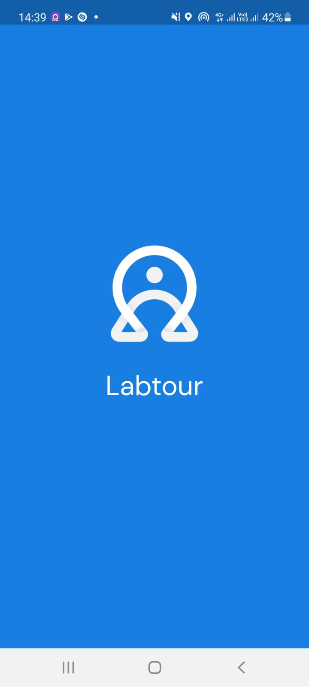
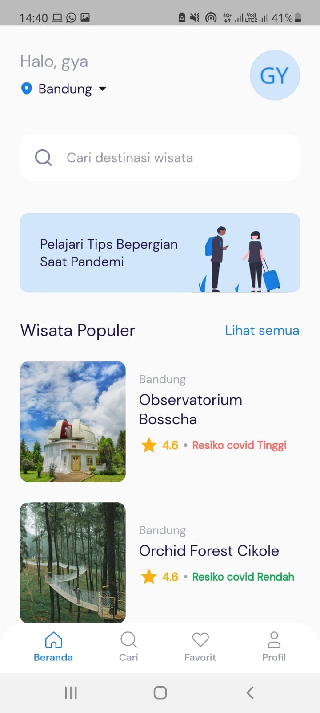
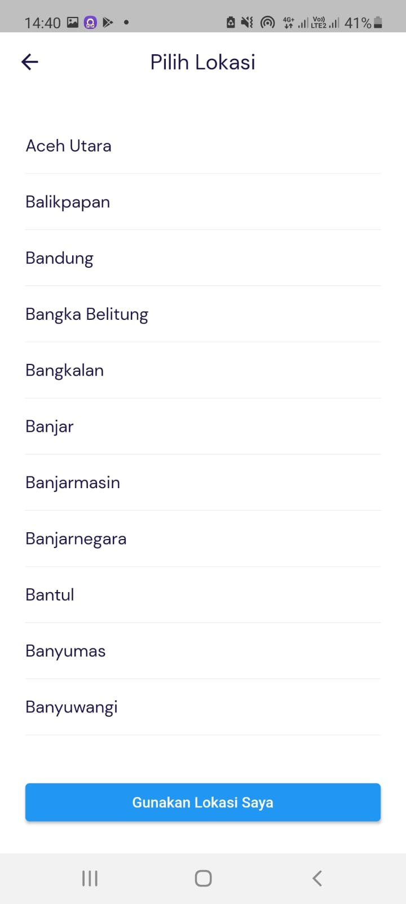
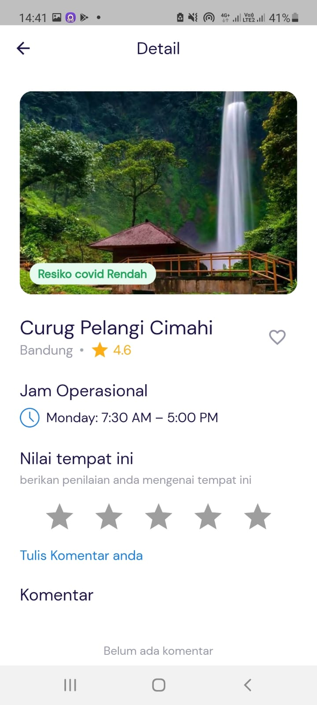
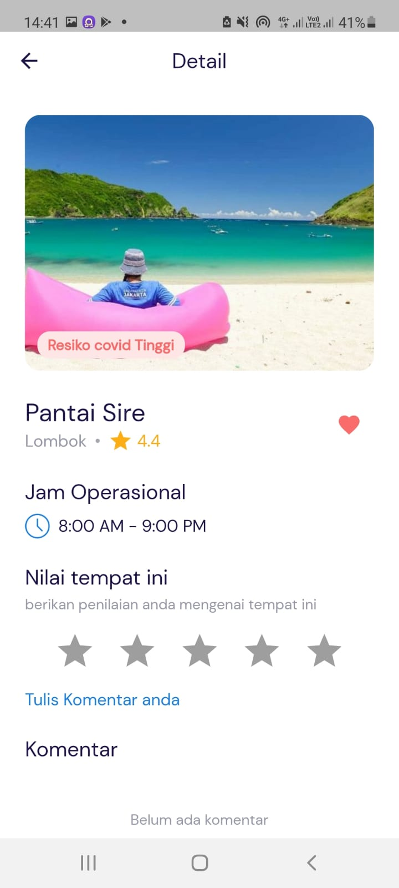

# labtour

Labtour adalah sebuah aplikasi Rekomendasi Destinasi Wisata di Indonesia berdasarkan tingkat resiko penularan covid-19

Teknologi yang digunakan untuk membangun aplikasi ini antara lain:
- Flutter
- Laravel
- Firebase
- SQLITE

  
  
  
  
   

## Fitur

- Rekomendasi Destinasi Wisata
- Pilihan wisata dari berbagai kota
- pencarian wisata di Indonesia
- simpan destinasi kedalam favorit
- beri komentar/review wisata
